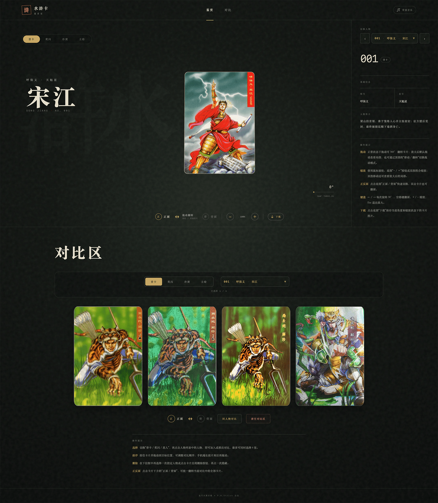
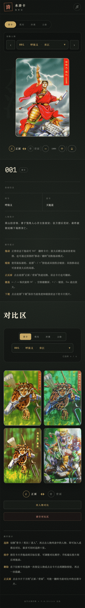

# 水浒卡鉴赏室

一个用于展示小浣熊水浒卡的响应式网站，提供卡片正反面鉴赏、基于 Three.js 的 3D 旋转与缩放、多版本卡片对比等功能，并支持 PC 端键盘操作及移动端触控交互。

项目功能由自己设计页面，借助 AI 生成代码，累计投入约 22 小时、重置了 5 轮 AI 用量周期，完成了素材搜集、开发调试、组件化重构、性能与交互体验优化、单元测试与线上部署等环节。

在线体验：[https://pwstrick.github.io/water-card/](https://pwstrick.github.io/water-card/)


## 页面预览

| PC 端 | 移动端 |
| --- | --- |
| [](demo/water-pc.png) | [](demo/water-mobile.png) |

## 功能

- 收录普卡、奖闪、冷烫、立绘四类卡片，以及 108 位好汉、6 大恶人和扩展人物资料
- 普卡提供 108 位好汉和 6 大恶人，冷烫额外收录异画、特卡和赠卡，立绘额外收录恶人卡和特卡
- 支持拖动旋转、缩放和正反面切换的 3D 卡片预览
- 支持卡片预览图下载
- 最多选择 6 张卡片进行正反面对比、拖动排序、同人物跨栏目对比和一键清空
- 支持人物快速检索、键盘操作和移动端浏览
- 提供《好汉歌》背景音乐开关

## 技术栈

- React 19
- Vite 8
- Tailwind CSS 4
- Three.js
- dnd-kit
- Vitest + Testing Library

## 本地开发

建议使用 Node.js 24，最低版本要求为 Node.js 20.19+ 或 22.12+。

```bash
npm install
npm run dev
```

开发服务器默认运行在 `http://localhost:5175`。

其他常用命令：

```bash
npm test          # 运行单元测试
npm run build     # 构建生产版本
npm run preview   # 预览构建结果
```

## 项目结构

```text
public/assets/standard/      普卡及恶人卡图
public/assets/flash_prize/   奖闪卡图
public/assets/code_perm/     冷烫卡图
public/assets/character_art/  立绘卡图
src/components/card-viewer/  Three.js 卡片预览
src/components/comparison/   多卡对比区域
src/components/common/       通用交互组件
src/config/                  卡图裁切和操作提示配置
src/data/                    好汉资料及卡组配置
tests/                       单元测试
```

## 卡片数据

好汉和恶人的基础资料分别维护在 `src/data/heroes.js`、`src/data/villains.js`，卡组在 `src/data/collections.js` 中统一注册。每张卡图包含正反两面，具体裁切范围由 `src/config/cardImageLayouts.js` 配置。

当前冷烫和立绘卡组都采用横向合并图：正面在左、背面在右，两面等宽。冷烫图宽度为 1800px，WebP 质量为 90；立绘图宽度为 1800px，WebP 质量为 80。文件编号规则如下：

- `1.webp`～`108.webp`：108 位好汉
- `109.webp`～`114.webp`：6 大恶人
- `115.webp`～`130.webp`：异画卡，下拉框展示编号为 `异01`～`异16`，人物绰号和介绍沿用对应好汉
- `131.webp`～`142.webp`：特别卡，下拉框展示编号为 `特01`～`特12`，包含其他人物的绰号、简介和结局
- `143.webp`～`145.webp`：赠送卡，下拉框展示编号为 `赠01`～`赠03`，人物名为扈三娘，作者名维护在 `edition` 字段

立绘卡组维护在 `src/data/character_art.js`，数据结构参考冷烫卡组拆分为：

- `1.webp`～`108.webp`：108 位好汉，沿用 `heroes.js` 中的基础资料
- `112.webp`～`114.webp`：恶人卡，下拉框展示编号为 `恶01`～`恶03`，分别为西门庆、潘金莲、高衙内
- `115.webp`～`118.webp`：特卡，下拉框展示编号为 `特01`～`特04`，分别为朱富（`edition` 为“错版”）、琼英、阎婆惜、李师师

新增完整卡组时，建议将正反面合并后转换为 WebP，并按上述人物编号放入 `public/assets/<卡组目录>/`，然后创建对应的数据模块并注册到 `collections`。如果卡图的正反面比例、位置或留白与现有卡组不同，还需要在 `src/config/cardImageLayouts.js` 中增加独立的裁切配置。

## 对比区

对比区默认展示四个版本的解珍：普卡、奖闪、冷烫和立绘。用户可以继续通过下拉框多选人物，最多同时保留 6 张卡片。

对比区支持以下操作：

- 统一切换正面 / 背面
- 拖动卡片调整顺序
- 点击单张卡片后显示删除按钮，并以退出动画移出
- 点击“同人物对比”，以当前第一张卡片的人物名为基准，自动替换为其他栏目中的同名人物；没有同名卡的栏目会跳过
- 点击“清空对比区”，所有卡片会先淡出下沉，再清空列表

## 部署

### GitHub Pages

推送到 `main` 分支后，GitHub Actions 会依次完成测试、构建、产物上传和 Pages 部署。GitHub Pages 使用 `/water-card/` 作为资源基础路径。

### EdgeOne Pages

EdgeOne 使用相同代码构建，建议配置如下：

- Node.js：24
- 安装命令：`npm ci`
- 构建命令：`npm run build`
- 输出目录：`dist`
- 环境变量：`DEPLOY_TARGET=edgeone`

设置 `DEPLOY_TARGET=edgeone` 后，Vite 会使用 `/` 作为资源基础路径，使网站可以直接部署在独立域名根目录。
